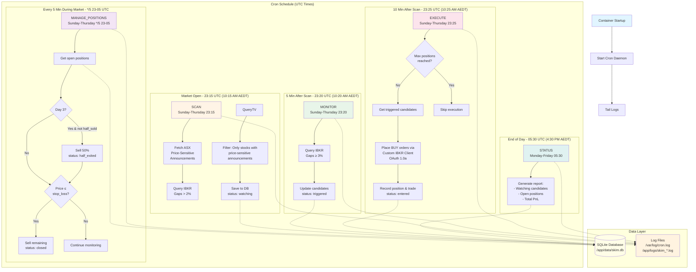

# Skim Trading Bot - Automated Workflow

## Cron-Managed Trading Workflow

The entire trading workflow is automated via cron jobs running in the Docker container.



## Workflow Confirmation

- **Cron is active** - Started by `/app/startup.sh`
- **All jobs configured** - Loaded from `/etc/cron.d/skim-cron`
- **Logs are captured** - Output to `/var/log/cron.log`
- **Custom IBKR Client** - OAuth 1.0a authentication via `ibkr_client.py`
- **OAuth configured** - All environment variables and key files present

## Manual Execution

You can manually trigger any workflow step:

```bash
# SSH into droplet
ssh root@

# Run any command manually
docker exec skim-bot /usr/local/bin/python -m skim.core.bot scan
docker exec skim-bot /usr/local/bin/python -m skim.core.bot monitor
docker exec skim-bot /usr/local/bin/python -m skim.core.bot execute
docker exec skim-bot /usr/local/bin/python -m skim.core.bot manage_positions
docker exec skim-bot /usr/local/bin/python -m skim.core.bot status
```

## Data Flow

1. **Candidates Table**: Stores stocks identified during scan
2. **Positions Table**: Tracks active trades with entry/exit prices
3. **Trades Table**: Records all buy/sell transactions
4. **Status Transitions**: watching → triggered → entered → half_exited → closed
