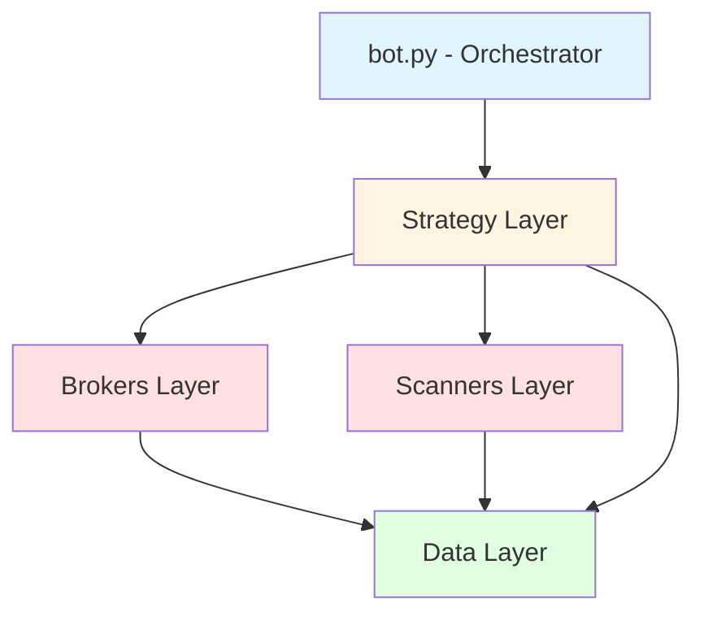
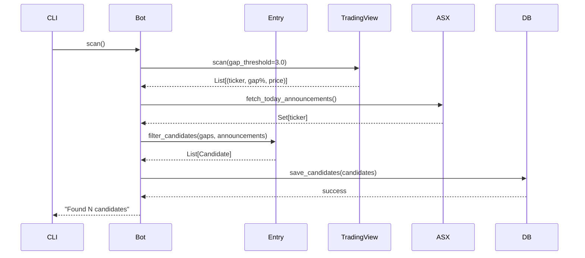
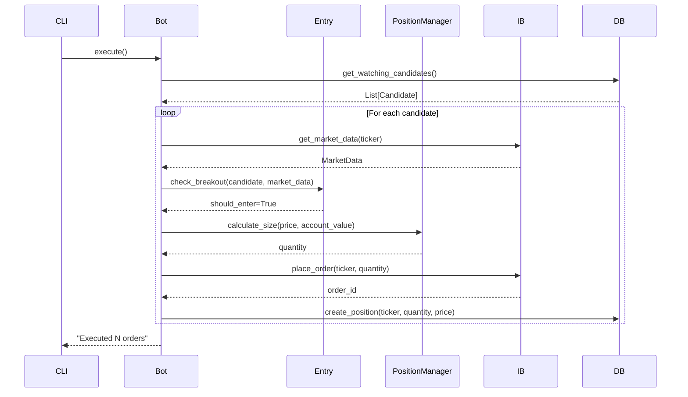
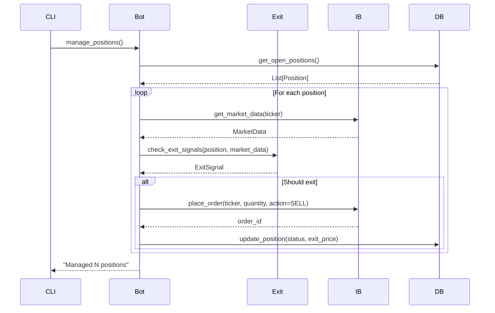

# Refactoring Architecture Design

**Date:** 2025-11-03
**Status:** Approved
**Goal:** Refactor 934-line bot.py into maintainable, testable package structure

## Overview

Transform monolithic bot.py into a layered architecture with clear separation of concerns, full pytest coverage, and modern Python package structure.

## High-Level Architecture



## Package Structure

```
src/skim/
├── __init__.py
├── core/
│   ├── __init__.py
│   ├── bot.py              # Orchestrator (thin layer)
│   └── config.py           # Environment configuration
├── data/
│   ├── __init__.py
│   ├── database.py         # Database operations
│   └── models.py           # Data models (Position, Candidate, Trade)
├── brokers/
│   ├── __init__.py
│   ├── ib_client.py        # IB connection & order execution
│   └── ib_interface.py     # Abstract interface for testing
├── scanners/
│   ├── __init__.py
│   ├── tradingview.py      # TradingView API client
│   └── asx_announcements.py # ASX price-sensitive scraper
└── strategy/
    ├── __init__.py
    ├── entry.py            # Entry logic (gap detection, breakout)
    ├── exit.py             # Exit logic (stop loss, trailing)
    └── position_manager.py # Position sizing, limits

tests/
├── conftest.py             # Fixtures (mock IB, test DB, sample data)
└── unit/
    ├── test_entry.py
    ├── test_exit.py
    ├── test_position_manager.py
    ├── test_scanners.py
    ├── test_database.py
    └── test_ib_client.py
```

## Component Responsibilities

### Core Layer

**config.py**
- Load environment variables
- Validate configuration
- Provide typed configuration object
- Single source of truth for all settings

**bot.py**
- Thin orchestrator that wires components together
- Delegates business logic to strategy layer
- CLI entry point with commands: scan, monitor, execute, manage_positions, status

### Data Layer

**models.py**
- Dataclasses for Position, Candidate, Trade
- Immutable where possible
- Type hints for all fields
- No business logic (pure data containers)

**database.py**
- All SQL operations
- Connection management
- Schema initialization
- Transaction handling
- Returns domain models, not raw SQL rows

### Brokers Layer

**ib_interface.py**
- Protocol/ABC defining broker interface
- Methods: connect(), place_order(), get_positions(), get_market_data(), disconnect()
- Enables testing with mock implementations

**ib_client.py**
- Real Interactive Brokers implementation
- Connection retry logic with exponential backoff
- Connection health checks
- Paper trading safety checks
- Error handling and logging

### Scanners Layer

**tradingview.py**
- TradingView scanner API client
- Returns list of (ticker, gap_percent, close_price)
- No side effects (pure function)
- HTTP error handling

**asx_announcements.py**
- ASX website scraper for price-sensitive announcements
- Returns set of ticker symbols
- BeautifulSoup HTML parsing
- Filters for price-sensitive flag

### Strategy Layer

**entry.py**
- Combines scanner data (gaps + announcements)
- Filters candidates based on strategy rules
- Checks breakout conditions against market data
- Pure business logic, no I/O

**exit.py**
- Stop loss logic (low of day)
- Half-exit on day 3
- Trailing stop with 10-day SMA
- Returns exit signals, doesn't execute orders

**position_manager.py**
- Enforces position limits (max 5 concurrent)
- Position sizing rules (max 1000 shares, $5000 per position)
- Calculates order quantities
- Validates position constraints

## Data Flow

### Scan Flow



### Execute Flow



### Manage Positions Flow



## Testing Strategy

### Unit Tests (pytest + pytest-mock)

**Strategy Layer:**
- Mock market data objects
- Test entry logic with various gap scenarios
- Test exit logic with stop loss, half-exit, trailing SMA
- Test position sizing with different account values

**Database Layer:**
- Use in-memory SQLite (`:memory:`)
- Test CRUD operations
- Test schema initialization
- Fast tests, no disk I/O

**Scanners Layer:**
- Mock HTTP responses with `pytest-mock`
- Use fixture files for sample API responses
- Test parsing logic with various HTML/JSON structures
- Test error handling (timeouts, invalid responses)

**IB Client:**
- Mock ib_insync.IB object
- Test connection retry logic
- Test paper trading safety checks
- Test order placement and position retrieval

### Test Fixtures (conftest.py)

```python
@pytest.fixture
def test_db():
    """In-memory SQLite for testing"""

@pytest.fixture
def mock_ib_client():
    """Mock IB client implementing ib_interface"""

@pytest.fixture
def sample_candidate():
    """Sample candidate for testing"""

@pytest.fixture
def sample_position():
    """Sample open position for testing"""

@pytest.fixture
def sample_market_data():
    """Sample market data for testing"""
```

## Migration Strategy

### Phase 1: Foundation (Data Layer)
1. Create `src/skim/` package structure
2. Extract `models.py` - define Position, Candidate, Trade dataclasses
3. Extract `database.py` - move all SQL operations
4. Write unit tests for database layer
5. Keep old bot.py for reference

### Phase 2: External Integrations (Scanners + Brokers)
1. Extract `scanners/tradingview.py`
2. Extract `scanners/asx_announcements.py`
3. Extract `brokers/ib_interface.py` (protocol)
4. Extract `brokers/ib_client.py`
5. Write unit tests with mocked HTTP/IB

### Phase 3: Business Logic (Strategy Layer)
1. Extract `strategy/entry.py`
2. Extract `strategy/exit.py`
3. Extract `strategy/position_manager.py`
4. Write unit tests with fixtures

### Phase 4: Orchestration (Core Layer)
1. Extract `core/config.py`
2. Refactor `core/bot.py` as thin orchestrator
3. Wire all components together
4. Test CLI commands end-to-end

### Phase 5: Cleanup
1. Update Dockerfile and docker-compose.yml
2. Delete old bot.py
3. Update README with new structure
4. Deploy and validate in production

## Docker Changes

### Updated Dockerfile

```dockerfile
FROM python:3.11-slim

WORKDIR /app

# Copy package files
COPY pyproject.toml ./
COPY src/ ./src/

# Install package in editable mode
RUN pip install -e .

# Copy additional files
COPY crontab ./

# Entry point
CMD ["python", "-m", "skim.core.bot", "run"]
```

### pyproject.toml Updates

```toml
[project.optional-dependencies]
dev = [
    "ruff>=0.8.0",
    "pytest>=7.4.0",
    "pytest-mock>=3.12.0",
]

[project.scripts]
skim = "skim.core.bot:main"
```

### CLI Entry Point

```python
# src/skim/core/bot.py

def main():
    """CLI entry point"""
    import sys

    if len(sys.argv) < 2:
        print("Usage: skim <command>")
        print("Commands: scan, monitor, execute, manage_positions, status, run")
        sys.exit(1)

    command = sys.argv[1]
    bot = TradingBot()

    if command == "scan":
        bot.scan()
    elif command == "monitor":
        bot.monitor()
    elif command == "execute":
        bot.execute()
    elif command == "manage_positions":
        bot.manage_positions()
    elif command == "status":
        bot.status()
    elif command == "run":
        bot.run()
    else:
        print(f"Unknown command: {command}")
        sys.exit(1)

if __name__ == "__main__":
    main()
```

## Backward Compatibility

### Guaranteed Compatibility:
- Same CLI interface: `scan`, `monitor`, `execute`, `manage_positions`, `status`
- Same environment variables (no changes needed)
- Same database schema (existing data works)
- Same Docker Compose configuration (just rebuild image)
- Same cron schedule

### Breaking Changes:
**None** - This is a pure internal refactor.

## Design Principles

### Dependency Direction
- Dependencies point inward: Scanners/Brokers → Strategy → Data
- No circular dependencies
- Outer layers depend on inner layers, never vice versa

### Single Responsibility
- Each module has one clear purpose
- Database handles persistence, not business logic
- Strategy handles business logic, not I/O
- Brokers/Scanners handle external integrations, not decisions

### Interface Segregation
- IB interface defines only what's needed for trading
- Scanners return plain data structures
- No leaky abstractions

### Testability
- Pure functions where possible (entry/exit logic)
- Dependency injection for external systems
- In-memory database for fast tests
- Mock HTTP/IB for unit tests

## Success Criteria

### Maintainability
- ✓ No file over 200 lines
- ✓ Clear module boundaries
- ✓ Easy to find code (obvious where things belong)

### Testability
- ✓ 80%+ code coverage
- ✓ Unit tests run in <5 seconds
- ✓ Can test strategy without IB/network

### Deployability
- ✓ Zero changes to docker-compose.yml
- ✓ Same CLI interface
- ✓ Existing database works without migration

### Readability
- ✓ Type hints everywhere
- ✓ Clear function signatures
- ✓ Self-documenting code structure

## Risks & Mitigations

### Risk: Breaking existing functionality
**Mitigation:** Keep old bot.py until refactor validated, gradual migration by layer

### Risk: Over-engineering
**Mitigation:** No dependency injection framework, keep it simple, YAGNI principle

### Risk: Docker deployment complexity
**Mitigation:** Minimal Dockerfile changes, same docker-compose.yml

### Risk: Testing overhead slows development
**Mitigation:** Fast in-memory tests, focus on business logic coverage first

## Next Steps

1. Review and approve this design
2. Create implementation plan with detailed tasks
3. Execute migration phase by phase
4. Deploy and validate

---

**Design approved:** Ready for implementation planning
